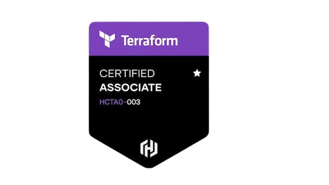

<h2 align="left">Olá 👋! Eu sou o Bruno Benetti</h2>

Sou um profissional em transição para a área de **DevOps/SRE**, com experiência prática em automação de infraestrutura, observabilidade, pipelines CI/CD e práticas de infraestrutura como código.

---

### 🧰 Tecnologias & Ferramentas

  
  
  
  
  
  
  
  

---

### 📈 Estatísticas do GitHub

  

---

### 📫 Onde me encontrar

  
  
  

---

### 📌 Sobre mim
### 📌 Sobre mim

- <a href="https://www.credly.com/badges/233aecd3-2f8a-46ef-98b0-da23625df2c1/public_url">
   Certificação HashiCorp Terraform Associate 003
  </a>
- ⚙️ Experiência com Azure DevOps e GitHub Actions  
- 🔍 Interesse em observabilidade, alta disponibilidade e práticas DevOps  
- 🚀 Atuo em projetos de automação com CI/CD, focados em infraestrutura como código (Terraform) e observabilidade com Prometheus.

- ⚙️ Experiência com Azure DevOps e GitHub Actions
- 🔍 Interesse em observabilidade, alta disponibilidade e práticas DevOps
- 🚀 Atuo em projetos de automação com CI/CD, focados em infraestrutura como código (Terraform) e observabilidade com Prometheus.

---

<!-- snake animation (opcional)

-->

